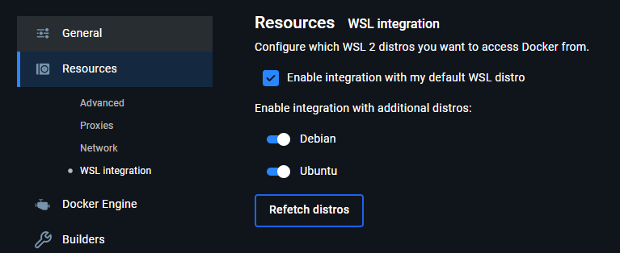

# Open Source ASIC Class
- [Docker Installation](#docker-installation)
  - [Windows](#windows-install)
  - [Mac](#mac-install)
  - [Linux](#linux-install)
- [VS Code Configuration](#vs-code-configuration)
  
# Docker Installation

## Windows Install
Everything we do in this class on Windows will be done in [WSL](https://learn.microsoft.com/en-us/windows/wsl/install). Install it from PowerShell using `wsl --install` and set up a username/password.

Install [Docker Desktop](https://www.docker.com/products/docker-desktop/). Once set up, enable WSL integration so that your WSL instances can access docker.

## Mac Install

### Step 1: Install Docker
Install [Docker](https://www.docker.com/products/docker-desktop/). 

After installation open Docker from your mac, make an account and ensure the software is running.

### Step 2: Install and Setup XQuartz
Ensure XQuartz is Installed and Running:

1. Install XQuartz from https://www.xquartz.org/. Launch XQuartz after installation. Configure XQuartz to Allow Network Connections:
2. Go to XQuartz > Preferences > Security. Uncheck the option Authenticate connections. Check the option Allow connections from network clients.
3. Restart XQuartz for the changes to take effect.

## Linux Install

Install [Docker](https://www.docker.com/products/docker-desktop/) with your preferred package manager. For example:
`sudo apt install docker` 

# VS Code Configuration
It is recommended to use VS Code as an editor due to its support for some useful extensions and interoperation with WSL.

## WSL Setup (Windows Only)
- Install the [WSL Extension](https://marketplace.visualstudio.com/items?itemName=ms-vscode-remote.remote-wsl), which allows VS Code to connect to WSL
- Connect to WSL by navigating to the remote explorer and pressing the arrow on your WSL image 
- The bottom left corner of the window should show that WSL is connected 
- Continue with the following setup

## All Platforms

- Install [Surfer](https://marketplace.visualstudio.com/items?itemName=surfer-project.surfer), a useful waveform viewer.
- Install [verilog-hdl](https://marketplace.visualstudio.com/items?itemName=mshr-h.veriloghdl), which provides syntax highlighting for System Verilog.

